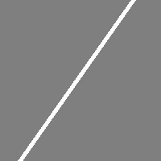
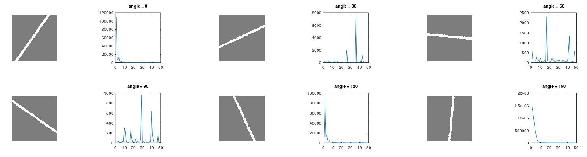
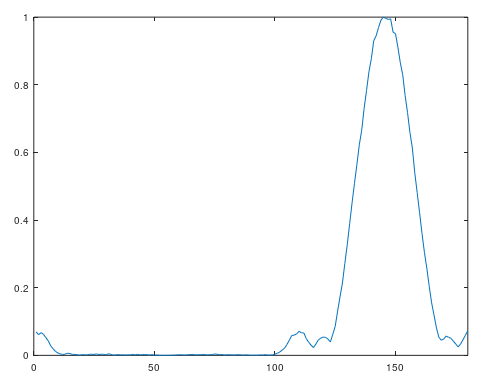
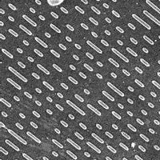
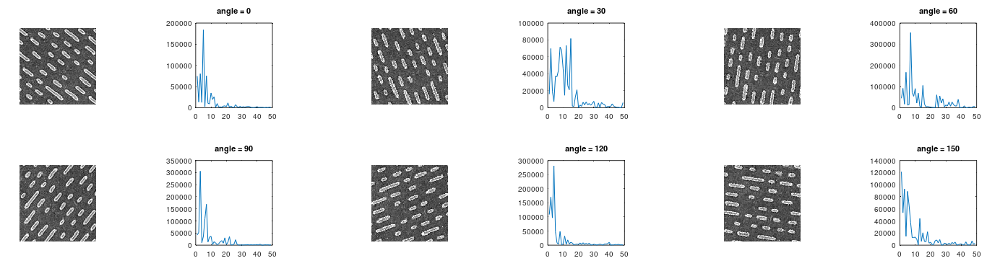
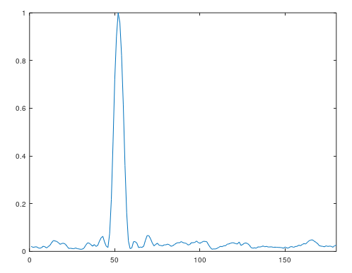
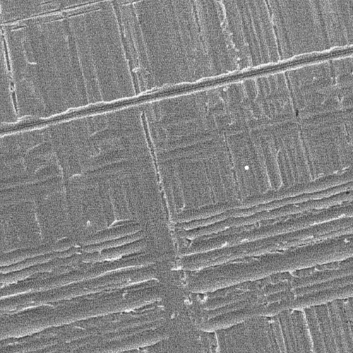
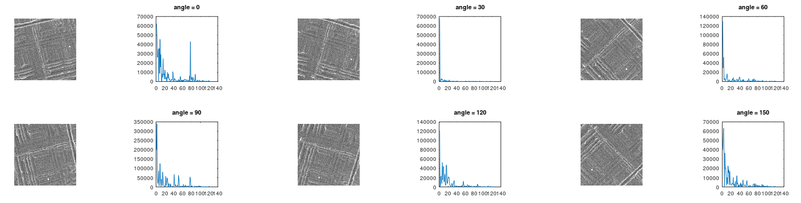
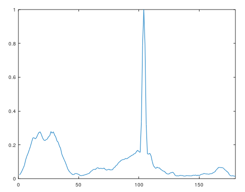

对 *RIMAPS* 算法的 octave 实现

*RIMAPS* 算法原文 https://doi.org/10.1046/j.1365-2818.2002.01003.x

# 1 介绍

原文对算法的描述有所保留，且目标值的归一化方法不明确。同时，目前在Google Scholar上可看到采用该算法的文章基本来自于同一家实验室，未找到更详细的算法描述或补充。

本实现在原文描述的基础上增加了以下补充

- 要求输入图片长宽相等
- 图片旋转后出现的空白部分以背景色进行填充，或截取无空白部分进行处理

- 滤除了零频信号

# 2 效果

## 2.1 例1（直线）

### 原图

### 各角度平均功率谱

### 结果

## 2.2 例2

### 原图

### 各角度平均功率谱

### 结果

## 2.3 例3

### 原图

### 各角度平均功率谱

### 结果

# 3 总结

本实现能够对较明显的表面方向特征进行检测，但与原文相比存在差异。

欢迎提出改进意见。